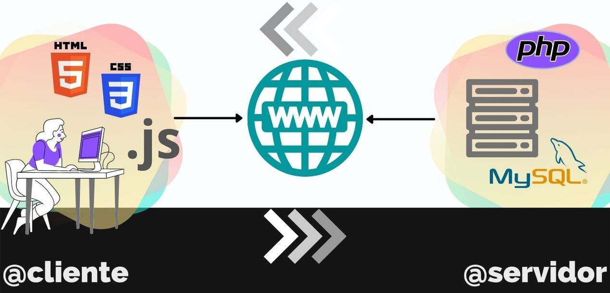

+++
title = "PRÁCTICA HUGO"
draft = false
image = "img/dwes/practica-hugo.png"
weight = 0
+++

<!--more-->

> **Ejercicio 1:** Realiza en un documento usando diagramas y detallando el proceso de carga de una página web. Contempla la posibilidad de tener que ejecutar script tanto en cliente como en servidor. Identifica en un bloque cada uno de los elementos (CLIENTE, SERVIDOR o MEDIOS) o programas necesarios (programa navegador, protocolo http en cliente, servidor dns, interprete de javaScript, ...)

 

> **Ejercicio 2:** A continuación te nombro varias herramientas/tecnologías para el desarrollo web.Se trata de que las agrupes y hagas un par de frases de qué es cada cosa.Usa tus propias palabras y aporta la url de su página oficialAprovecha este ejercicio para ampliar tu vocabulario y conocimiento técnico:

                Babel WebPack Prototype Polyfill
                PHP Frameworks de php
                DJango  JSP  Css Bootstrap 
                Vue React Angular JavaScript TypeScript  JQuery
                Gatsby  Hugo  Jekyll  Pelican Scraping heroku 
                Vuespress 

    

> **Ejercicio 3:** Comenta las siguientes arquitecturas.

                XAMPP WAMPP LAMPP  MEAN LEMP AMPPS BitNami

Estas arquitecturas tienen que ver con la asignatura "Despliegue de aplicaciones web". Vienen a ser servidores que incluyen todo en 1: servidor, gestor de bases de datos y lenguaje de programación. No todos son compatibles en todos los sistemas operativos, pero por suerte, hay muchos que sí.